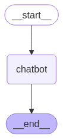
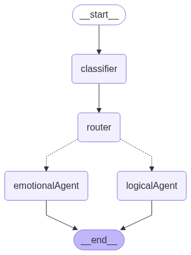

# 🧠 LangGraph Chatbot Playground

Welcome to my LangGraph learning project! This repo showcases two examples of chatbot implementations using [LangGraph](https://github.com/langchain-ai/langgraph), an advanced framework for building stateful, multi-agent workflows.

---

## 📚 Overview

This project includes two LangGraph-based chatbot demos:

### 1️⃣ Basic Single-Turn Chatbot

> A minimal example of a LangGraph flow: `start → chatbot → end`

- Simple conversation handler using a single LLM node.
- Demonstrates how to structure a graph and persist messages.
- Ideal for understanding the **bare minimum** LangGraph setup.

### 2️⃣ Multi-Turn Routed Chatbot

> An advanced example with **routing**, **memory**, and **agent classification**

- Classifies user input and dynamically routes it to the right agent handler.
- Persists multi-turn chat history.
- Designed to simulate more **realistic, modular** chatbot workflows.

---

## 🛠️ Setup

### 1. Clone the repo

```bash
git clone https://github.com/yourusername/langgraph-chatbot.git
cd langgraph-chatbot
````

### 2. Create a virtual environment

```bash
python -m venv env
source env/bin/activate  # or `env\Scripts\activate` on Windows
```

### 3. Install dependencies

```bash
pip install -r requirements.txt
```

> ✅ Dependencies are automatically generated using `pipreqs`.

### 4. Setup Environment Variables

Create a `.env` file in the root with your Gemini API key:

```
GOOGLE_API_KEY=your_google_api_key_here
```

---

## ▶️ Run the Examples

### 🔹 Basic Chatbot

```bash
python basic_chatbot.py
```

### 🔸 Routed Multi-Agent Chatbot

```bash
python routed_chatbot.py
```

---

## 🧭 Flow Diagrams

LangGraph makes it easy to **visualize the flow** of your application.

### ✅ Example: Basic Flow



### ✅ Example: Routed Chatbot Flow



> These were generated using:

```python
from IPython.display import Image, display

try:
    display(Image(graph.get_graph().draw_mermaid_png()))
except Exception:
    pass  # Mermaid rendering requires extra dependencies
```

---

## 📈 What I'm Learning

* [x] How to build graphs with LangGraph
* [x] How to persist chat history in state
* [x] How to classify and route user input dynamically
* [x] Visualizing LangGraph workflows using Mermaid
* [x] Gemini LLM integration via `langchain_google_genai`

---

## 🧪 Future Work

* Add memory using LangChain memory modules
* Integrate tools (search, calculators, etc.)
* Deploy as a FastAPI backend or Streamlit UI

---

## 📄 License

MIT License. See [LICENSE](LICENSE) for details.

---

## 🤝 Acknowledgments

Thanks to the LangGraph and LangChain teams for the amazing open-source tools!

---

## 🔗 Resources

* [LangGraph Docs](https://docs.langgraph.dev/)
* [LangChain Docs](https://docs.langchain.com/)
* [Google Gemini Models](https://ai.google.dev/)

```

